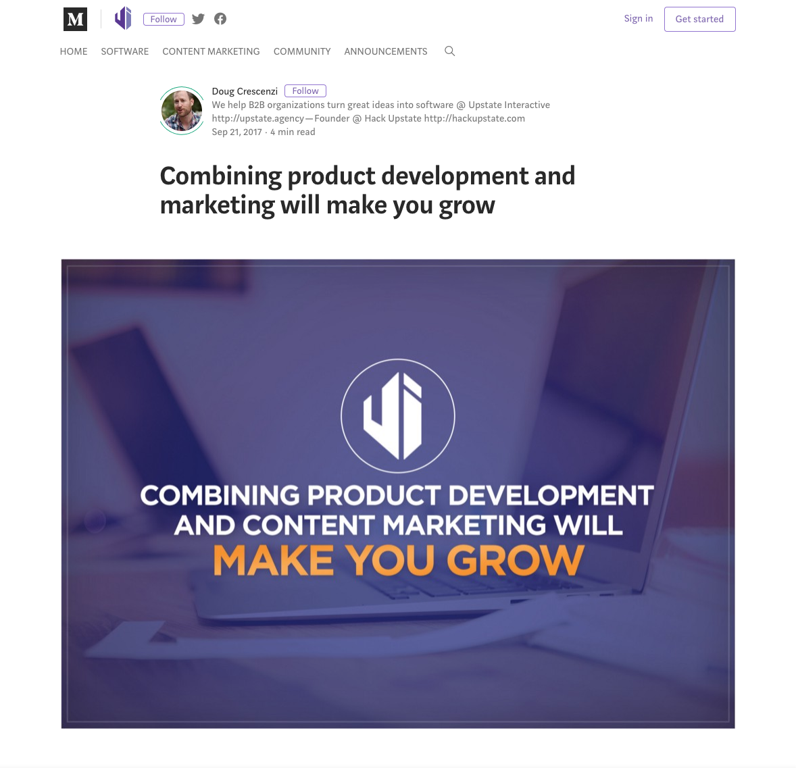
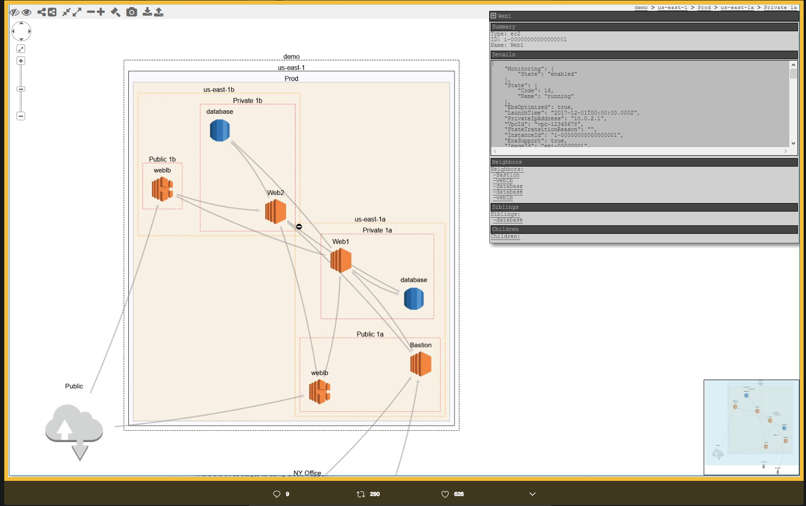
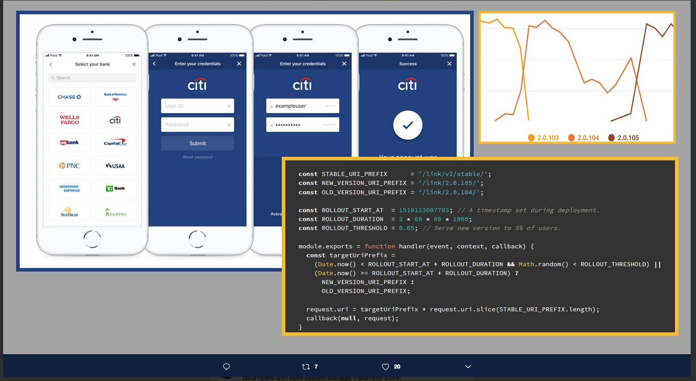

# _Phase One: The Search_

## Search

_I decided to search "how to combine marketing and development".Here is what I found_

## How and why to combine marketing and development

_Blog From Medium written by Doug Crescenzi [Combining product development and marketing will make you grow](https://blog.upstate.agency/combining-product-development-and-marketing-will-make-you-grow-ed3a7f4b17e6)_

## What I found from the reading:

* **Keeping marketing and development separate is common.** This article is written to display why development and marketing should be combined which tells me that separate silos are not knew or unusual.
* **Development and marketing are often considered two separate mindsets.** The issue of keeping marketing and development separate comes down to the isolation of two separate mindsets. Developers ask the questions such as "What features does the user need?" while Marketers ask "How do we position ourselves compared to the competition?". The answer to these questions could certainly be different but they could also be the same. Features created could also be the edge that differentiates business from the competition.
* **In the world filled with unlimited data we should share more of our data points** Another issue with keeping the developers and marketers separate is limited data sharing. Keeping dev teams and marketing teams separate means the only point of shared thoughts/ideas/data would be up to those teams to construct.Both teams are receiving feedback from clients and customers and are being kept as separate conversations and both teams are none the wiser.When I was working in an agency we were constantly looking for people to make sense of data(from campaigns, social media, ads, etc.), anything we could find that would bring a story to our numbers was extremely helpful to us and the client. Data points are helpful in the pursuit of any mission.
* **Collaboration of marketing/development leads to better understanding of both the product and the customer** As described in our prompt today, all tech is problem solving! Tech deals with helping users see things, learn things, do things and buy things. Business has a similar structure! Working in both marketing and development leads to better understanding of what the customer needs, what features to prioritize and a better understanding of the software.

## Marketing in Software as a Service

_Next, I decided to search SaaS.During my time at Epicodus, I have learned more about SaaS companies. I heard that term all through college but it never really had meaning until I was in Epicodus.Here is what I found_

## 7 SaaS Companies that Succeeded with Content Marketing

_Blog from Forbes written by Sujan Patel on (11/26/2016) [7 Saas Companies That Succeeded with Content Marketing](https://www.forbes.com/sites/sujanpatel/2016/11/26/7-saas-companies-that-succeeded-with-content-marketing/#308eab9273fa)_

## What I found from the reading:

* **Content marketing for software can be challenging but that is the fun part** In the world of lifestyle brands and free spirited influencers it can be easy to get swallowed up in a newsfeed of travel images and quotes about wanderlust. As a content creator, I was constantly trying to think of content that was as captivating as Patagonia, REI, and many other lifestyle brands. In comparison to Patagonia, an Instagram campaign for software could be boring but the comparison is apples to oranges. Software marketing is a chance for eduction and breaking down problems. Sujan Patel makes a point that some of the best marketing in software is not done in house but is down by experts in a "how-to" tutorial. Answering questions of the public is excellent marketing and software can often bring up hundreds of questions!

* **Teaching can build trust** The idea of creating "how -to" videos, case studies and guides is exactly what content marketing is all about. As a marketer I want to create content that is compelling for people and as a development I want to create tools that will make people's lives easier. As I continue through school I would like to work on my technical writing but want to writing in a compelling way. I also think pictures and motion graphics would be a great way to market software and answer the questions of the internet.

## AWS Jeff Barr

_As I continued down the rabbit hole of my searches I found some information on AWS and their marketing team. At Epicodus I have been able to learn more about AWS through guest speakers. I stumbled upon Jeff Barr's twitter and found that he is the Chief Evangelist for AWS. His job description reads "Jeff gets to tell the AWS story to audiences all over the world. Jeff talks, blogs, records videos, and spreads the word via social media".Below I have added Jeff Barr's twitter account._

_[Jeff Barr Twitter](https://twitter.com/jeffbarr)_

## What I found from following Jeff Barr on Twitter:

* **The importance of finding your community** Jeff Barr has 125K followers on twitter and he does a great job catering to the community he wants to engage. He posts how-to's and images along with industry trends and personal experiences all of which are relatable to his tribe.

* **The importance of displaying the same information different ways** Jeff has a lot of tweets about the same topics but he presents them in different ways knowing that different presentations will resonate with different people. Personally, I am more visual so having the images and graphs helps me in a lot of ways.

## What is marketing technology?
_I decided to look into more about what exactly marketing technology is.I found an article from AdAge on "MarTech"._

_Marketing Technology Explained: Everything You Need Know written by George Slefo(4/18/2017)[AdAge](http://adage.com/article/digital/marketing-technology-explained/308661/)_

* **Marketing Technology is different from AdTech** Marketing Technology can be confused with Advertising Technology. Marketing Technology is used to build,manage,deliver and optimize campaigns. Again, it is all about problem solving marketing technology is solving different problems from advertising technology.

* **Data is huge** Again, everyone wants to make sense of their data. Businesses are collecting all sorts of information daily and they want to be able to take that data and turn it into something they can use.

* **AI** The article brings up a good point about trends in martech, currently on the rise is artificial  intelligence. The reason being is making sense of all of the data but also being able to scale the work that comes with using data to alter campaigns to different demographics.

## What other titles are there besides marketing engineer?

_I decided to look up titles similar to marketing engineer. I found a compelling title of Information Architecture - the structural design of shared information, environments, and the art and science of organizing and labeling websites, intranets, online communities and software to support usability and findability._

_IA and UX design(https://uxplanet.org/information-architecture-basics-for-designers-b5d43df62e20)_

* **User Experience** User experience weighs heavy on number of returns a site experiences. If the site takes forever to load, if something is hard to find, if the search functionality doesn't work well, are all examples of why users would leave a site and would also contribute to why users wouldn't return to a site. I feel I am too junior to apply to IA positions yet but with this knowledge I plan to work more on the user friendliness of my applications in school and as I move in my career.  

## What marketing software is out there?

_I googled the top marketing software firms and found a list of the best marketing software for 2018._

_Top Marketing Softwares for 2018(https://www.softwareadvice.com/marketing/)_

* **Top Trends** The top trends for marketing software as listed by this website are InfusionSoft, Marketo, Salesforce, Campaign Monitor, SharpSpring, ActOn. I recently went to a MeetUp hosted by ActOn and found it had a lot of what I was looking for in a company. They are currently hiring(https://www.act-on.com/careers/listings/)
