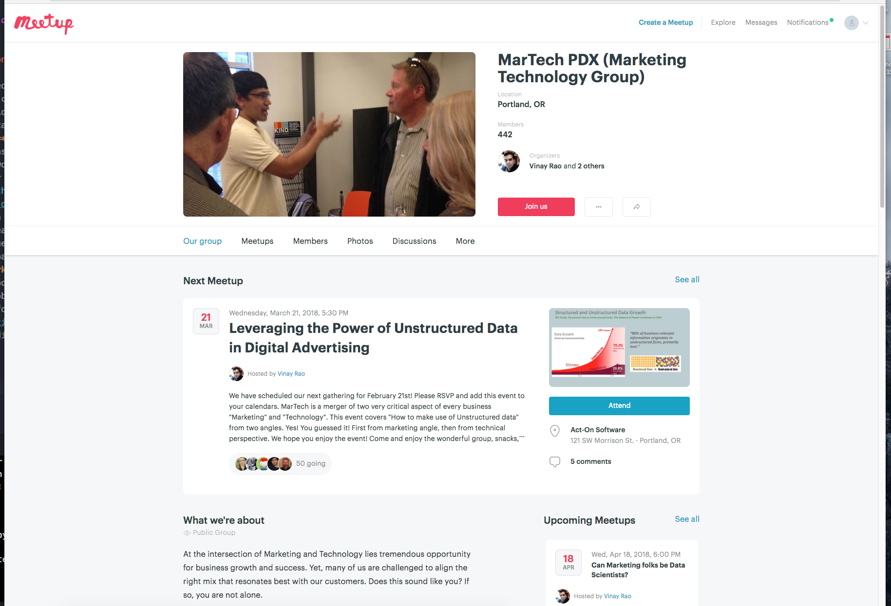
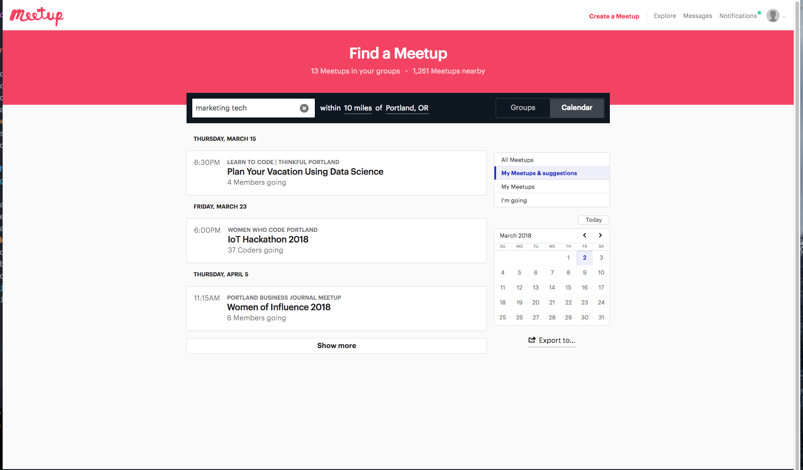

# _Phase Two: The Plan_

## Search

_In Phase One(Phase1.md) I added a list of my questions, searches and findings. In Phase Two I would like to discuss a plan moving forward._

## What I can work on in school and beyond to feel confident in my career:

  * **Data** In my findings I highlighted multiple points where marketing and development meet in a happy union which often includes data. As I continue on in school and into a I would like to work on collecting and making sense of data and information.  I would like to work more with plotly.js or other graphing libraries to reveal patterns in applications.
  * **User Interface/structures of site** As I continue, I would like to work more with user interfaces, I know in Java I did not do that quite as much and I did some in JS but I am looking forward to working on front end in Android. I also want to work on creating layouts that make sense and would be user friendly. Thinking more about the user and their experience will only help me moving forward.
  * **Study** I read [I spent three months applying to jobs after a coding bootcamp.Here's what I learned.](https://medium.freecodecamp.org/5-key-learnings-from-the-post-bootcamp-job-search-9a07468d2331).The section about studying reasoned with me. I have not had to do any sort of knowledge based interview before Epicodus. In addition, I get really nervous. Dealing with different types of marketing and software could bring up all sorts of diverse questions, having a knowledgable answer for all different types of tech questions will be important for this path.
  * **Learn more about software/frameworks/dev tools** To be successful in working/creating/selling good marketing tech I want to learn more about what is out there and how they work.   
  * **Technical Writing** I have seen jobs hiring in Technical Writing which I think could be a good bridge between development and marketing. I found a site [how to become a technical writer](https://www.instructionalsolutions.com/blog/become-a-technical-writer) which actually sounds very interesting to me and would help solidify concepts and terminology used in certain industries.

## Where I can go to learn more:

  _I found a few promising events on MeetUp. I have attached the images below._

  
  

  _Medium also offers a lot of different views on all different topics._

  Medium(https://medium.com/)

## Who I can talk to:

  _I looked around my LinkedIn to find a few companies I could reach out to. They work at companies ranging from Intel, Oracle to smaller agencies._
